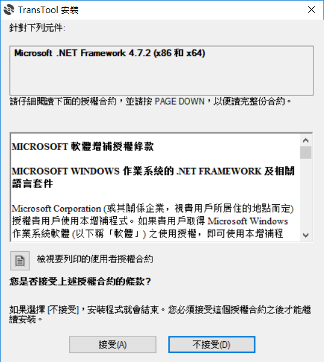
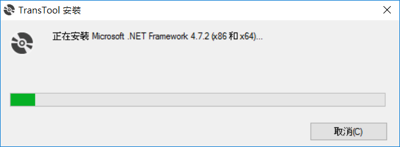

# 下載安裝程式

檔案下載網址 [CR翻譯工具](CR翻譯工具.ZIP) .

# 安裝環境

1. 解開壓縮檔案

在目錄下會有 setup.exe , 點選該檔案來進行安裝

2. 預備環境

如果環境下沒有 .Net framework 的情況下，則會出現該提示畫面，讓使用者可以透過線上下載的方式來進行安裝，選擇 *接受* 即可進行下載。但如果環境中已經有安裝 .Net Framework，則會自動跳到後面的安裝程式的部分

3. 安裝中

此部分則視網路狀況和主機效能，大約會花 3-5 分鐘進行下載。

4. 安裝完畢

安裝好 .Net Framework 之後，則會提示使用者重新開機

