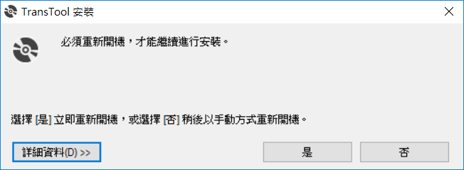

# 下載安裝程式

## 檔案下載網址 [CR翻譯工具](CR翻譯工具.ZIP) .

# 安裝環境

## 解開壓縮檔案

在目錄下會有 setup.exe , 點選該檔案來進行安裝

## 預備環境

如果環境下沒有 .Net framework 的情況下，則會出現該提示畫面，讓使用者可以透過線上下載的方式來進行安裝，選擇 *接受* 即可進行下載。但如果環境中已經有安裝 .Net Framework，則會自動跳到後面的安裝程式的部分

## 安裝中

此部分則視網路狀況和主機效能，大約會花 3-5 分鐘進行下載。

## 安裝完畢

安裝好 .Net Framework 之後，則會提示使用者重新開機

# 安裝程式

## 執行安裝作業

如果之前已經安裝好 .Net Framework 的話，則執行安裝程式 setup.exe 之後，就會進入此畫面。但如果沒有安裝 .Net Framework 的話，則經過前面 *安裝環境* 的步驟，再重開機之後則繼續點選 setup.exe 來進行安裝程式。看到畫面之後，選擇 *安裝* 即可。

## 啟動作業

安裝好之後，則會自動帶起 CR翻譯工具，此時可以選擇右上方的 X 按鈕關閉作業

## 設定啟動捷徑

關閉作業之後，點選 Windows 左下方 Windows 的圖示，則會出現選單。此時可以選擇剛剛安裝的 TransTool 的工具，按下滑鼠右鍵，選擇將作業 *釘選到工作列* ，這樣下次要找作業就會比較方便一點了。

# 備註

# 資料來源如果是文字檔案，則將 查詢文字 和 特換文字 之間，使用 *,* 符號來進行分隔
