# Crystal Report 2020 安裝說明

## 執行安裝作業
此部分會需要花比較長的時間，因此 Crystal Report 的壓縮檔案內有較多的檔案，因此如果磁碟速度較慢，可能會需要等待較長的時間

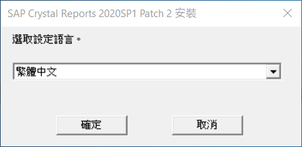

## 設定安裝目錄
Crystal Report 雖然是 64 位元，但主要的報表設計器還是 32 位元，因此預設安裝目錄會在 C:\Program Files(x86) 下面，此部分可以按照您磁碟空間的配置，選擇安裝到您所想要安裝的目錄下

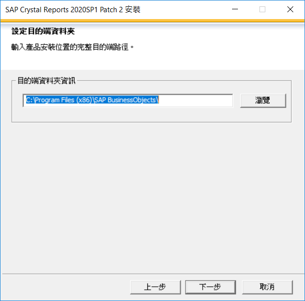

## 檢查所要安裝環境的相關設定
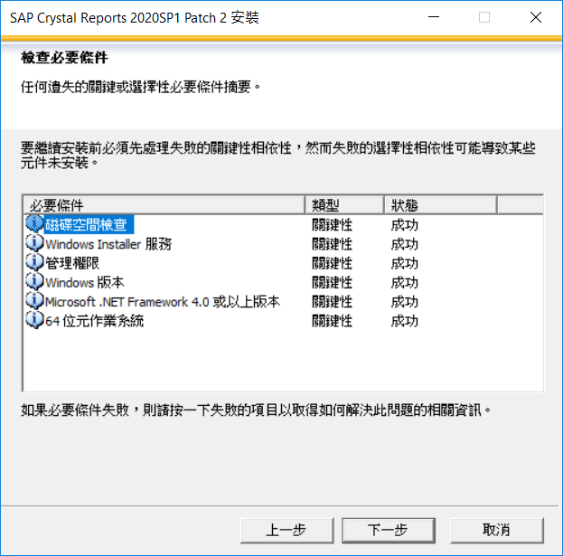

## Welcome
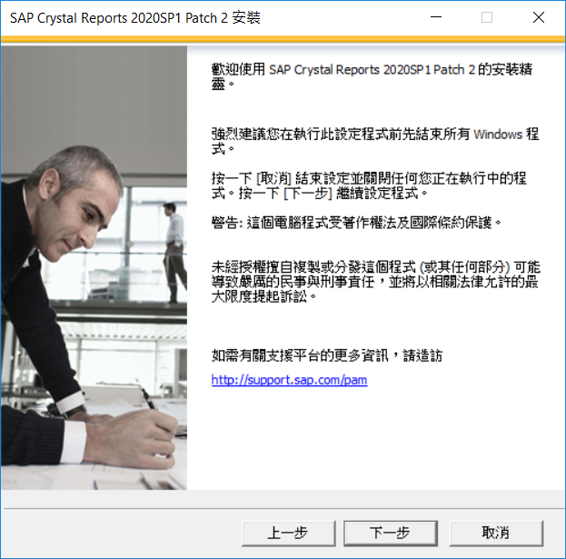

## 接受授權合約
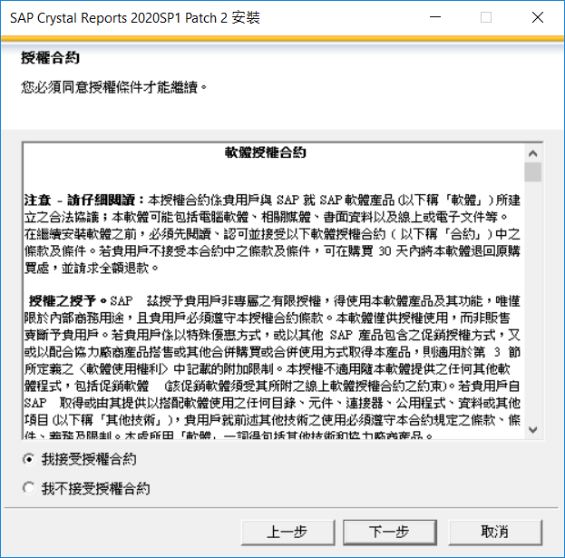

## 輸入序號
如果是個人開發環境，可以上 SAP 網站申請 30 天的測試序號
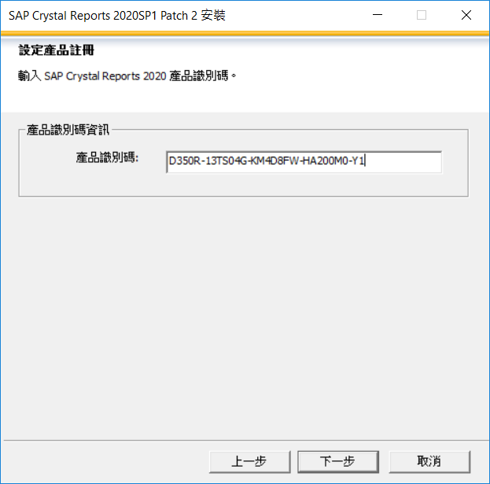

## 選擇語言別
基本上此部分所設定的是報表設計器的 UI 所支援的語言別，跟 Crystal Report 所能支援的語言沒有影響，因此不必安裝所有的語言，只需要安裝您設計報表所想要搭配的語言別即可

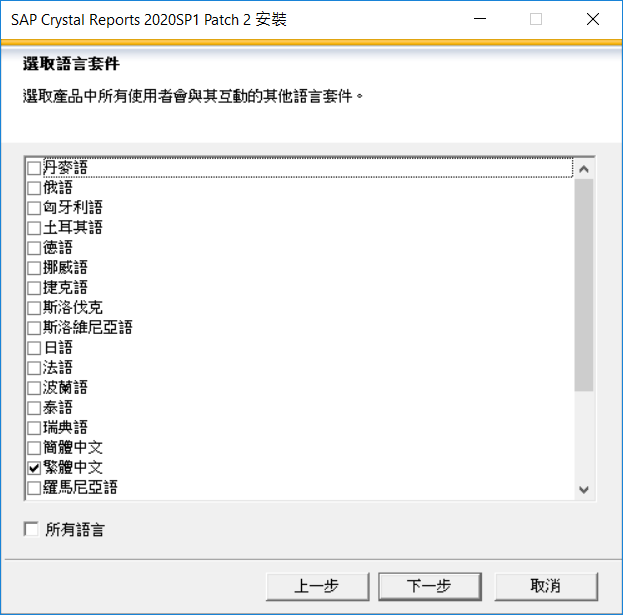

## 安裝類型 - 典型
此部分可以選擇「典型」的方式，這會安裝較多的支援套件和功能，基本上大部分對使用上來說都沒有特別影響，如果不是那麼在意磁碟空間，可以選用典型的方式安裝即可

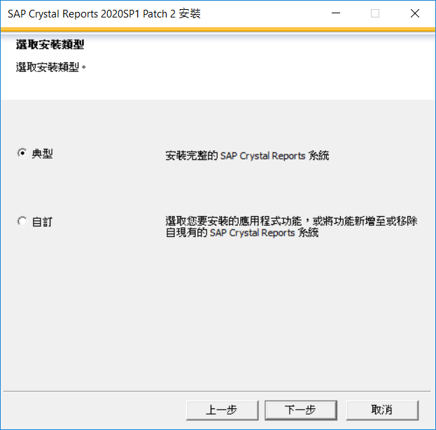

## 安裝類型 - 自訂
如果想要精簡安裝，則可以選擇「自訂」的方式，自己挑選所要安裝的功能

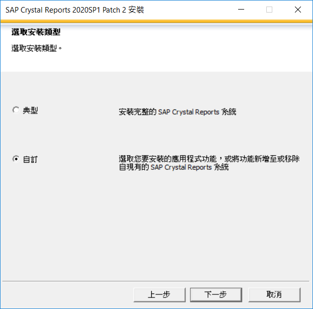

基本上可以只選擇畫面中這幾項即可，其他的功能在跟 TIPTOP GP 整合的時候就不會使用到了

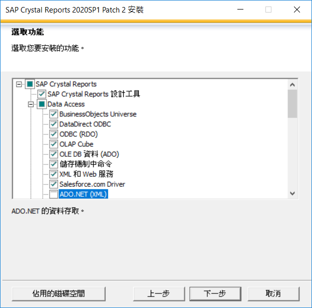

## 開始安裝
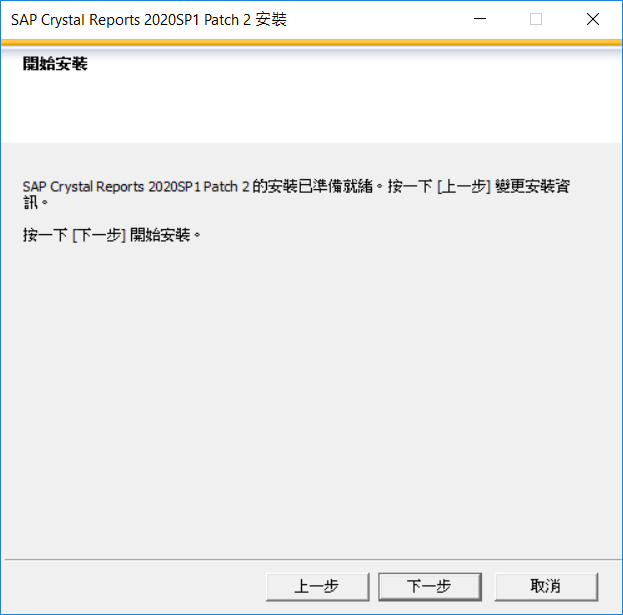

## 進行安裝
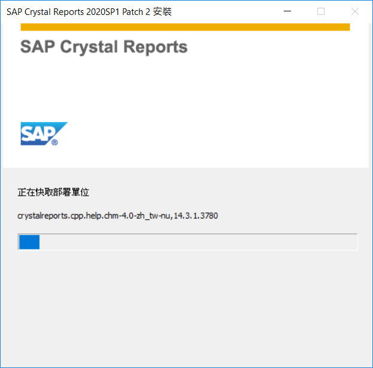

## 完成
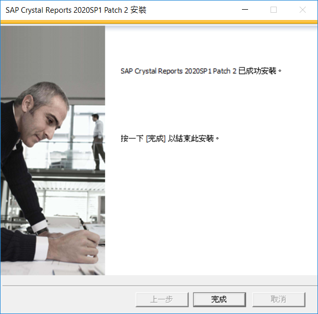

