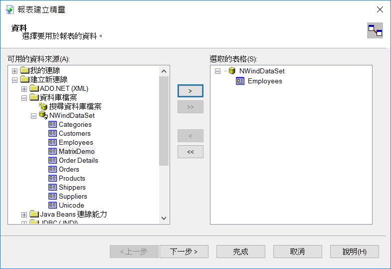

# Crystal Report 2020 安裝說明

如果需要測試版本，可以前往 SAP 的網站註冊並下載測試版本 https://www.sap.com/products/crystal-reports/trial.html 

## 執行安裝作業
此部分會需要花比較長的時間，因此 Crystal Report 的壓縮檔案內有較多的檔案，因此如果磁碟速度較慢，可能會需要等待較長的時間

## 設定安裝目錄
Crystal Report 雖然是 64 位元，但主要的報表設計器還是 32 位元，因此預設安裝目錄會在 C:\Program Files(x86) 下面，此部分可以按照您磁碟空間的配置，選擇安裝到您所想要安裝的目錄下

## 檢查所要安裝環境的相關設定
如果您的作業系統上沒有預先安裝好 .Net framework 4 的話，則這裡就會檢查失敗，那您就必須先回到作業系統的新增移除程式，將 .Net framework 4 給安裝上去。目前會使用 Crystal Report 2020 的環境，主要是 Windows 10 , Windows Server 2016 , 2019 , 這些作業系統都會預設安裝好 .Net Framework 4 , 所以當您被提是需要安裝 .Net framework 4 的時候，很有可能是您的作業系統版本太舊所導致的，這就需要特別去注意一下了。

## Welcome

## 接受授權合約

## 輸入序號
如果是個人開發環境，可以上 SAP 網站申請 30 天的測試序號

## 選擇語言別
基本上此部分所設定的是報表設計器的 UI 所支援的語言別，跟 Crystal Report 所能支援的語言沒有影響，因此不必安裝所有的語言，只需要安裝您設計報表所想要搭配的語言別即可

## 安裝類型 - 典型
此部分可以選擇「典型」的方式，這會安裝較多的支援套件和功能，基本上大部分對使用上來說都沒有特別影響，如果不是那麼在意磁碟空間，可以選用典型的方式安裝即可

## 安裝類型 - 自訂
如果想要精簡安裝，則可以選擇「自訂」的方式，自己挑選所要安裝的功能

基本上可以只選擇畫面中這幾項即可，其他的功能在跟 TIPTOP GP 整合的時候就不會使用到了

## 開始安裝

## 進行安裝

## 完成

---------------------------
# 設計報表

## 啟動 Crystal Report 設計工具
第一次會出現提示一些說明訊息，此部分按下確認即可

## 調整顯示語系
如果您的畫面顯示的並非是您當時安裝所挑選的語言別，可以透過「檢視」→「產品地區設定」，來挑選您所想要使用的語言別，設定好之後重新啟動，就可以出現您所習慣使用的語言別了。

## 建立新報表
這裡我們展示如何建立一張全新的報表，此時透過畫面上「檔案」→「新增」→「標準報表」，就可以透過精靈式的操作，一步一步來完全一個基本報表的建立

## 選擇資料來源
基本上 Crystal Report 支援多種的資料來源，但為了方便說明以及配合 TIPTOP 的整合方式，這裡我們展示透過「資料庫檔案」的方式來提供資料給報表設計器使用

## 選擇資料庫檔案
資料庫檔案基本上是一個 ADO 的 XML 檔案格式，這裡我們利用範例的北風資料庫，來展示報表的製作，有興趣的可以下載這個 XML 檔案回去使用 [用另存連結的方式下載範例XML](nwind.xml)

## 選擇使用的資料集合
這裡我們將前面 XML 檔案內的集合，選擇我們要使用的來做設計，這裡我們先用 Employee 這裡來作範例

## 加入要顯示的欄位
這裡我們先把所有欄位加入

## 加入要群組的欄位
因為我們主要是展示報表設計，這裡我們就不加入

## 加入要過濾的條件
這個在後續製作報表的時候也要記得不要設定，因為我們不會透過 Crystal Report 的畫面來做過濾處理，避免跟 TIPTOP 的處理相互衝突，所以這裡要記得不要加入

## 設定報表樣式

## 完成一張報表
預設會進入到「預覽」頁籤

## 調整報表樣式
有需要調整則可以選擇「設計」頁籤，就可以來調整報表的樣式，調整好之後選擇前一個步驟的「預覽」頁籤，就可以馬上看到調整後的結果了。

---------------------------

# 使用 Visual Studio 設計報表

## 管理延伸模組
在 Visual Studio 內，可以利用加掛延伸套件的方式，直接整合報表開發介面在 Visual Studio 內，可以選擇菜單列上面的「延伸模組」→「管理延伸模組」

## 加入 Crystal Report 開發版本
在模組管理內，可以輸入關鍵字 "Crystal Report"，就可以方便找到可以搭配 Visual Studio 來使用的 Crystal Report 的選項，就可以按下載件來進行下載

## 導向到 SAP 網站
透過上述的步驟，並不能直接下載，會直接導向到 SAP 的網站上，如果您之前已經有註冊過免費的帳號，那麼就可以直接下載。如果尚未註冊過，則需要先去註冊一個帳號，才會出現相關下載的選項。此時我們需要選擇 Crystal Report for Visual Studio 來進行安裝。

## 解壓縮安裝程式
跟之前說明 Crystal Report 的安裝相同，因為下載的是一個自解的壓縮程式，因此執行後會先出現一個解壓縮的畫面

## 選擇語言別

## 歡迎畫面

## 接受授權合約

## 開始安裝

## 進行安裝

## 完成

## 安裝 Runtime
這個步驟主要是會在 C:\inetpub\wwwroot\aspnet_client\system_web 的目錄下，安裝相關的 ActiveX 和 Java Script 的網頁，如果需要透過網站來看報表的話，則會需要這些檔案。

## 開啟 Visual Studio 載入報表
當第一次在 Visual Studio 建立或開啟 Crystal Report 報表的時候，會出現警告訊息，這裡選擇確認就可以了。

## 編輯報表
完成上述步驟，就可以使用 Visual Studio 來編輯 Crystal Report 的樣板檔案了，使用這個方式是可以不用購買 Crystal Report 的 License，雖然可以用這樣的方式來設計報表，但這個不能當成真正的報表主機來用，使用上來說也沒有比真正的 Crystal Report 的設計器來的好用，只能說這個一個很陽春的編輯器，可以用但體驗卻不會很好。

