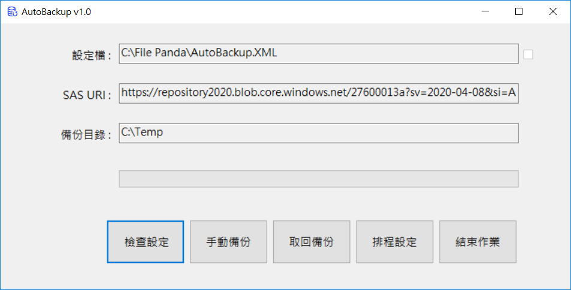

# File Panda 安裝手冊

## 執行安裝程式
透過此連結下載檔案 [download](/20210410/FilePanda_Install.exe) 最後更新時間 : 2021/04/21 22:00 

[修改紀錄](20210410/readme.md) 2021/04/10 修改說明

[修改紀錄](20210409/readme.md) 2021/04/09 修改說明

### 歡迎畫面

### 選擇安裝路徑，使用預設即可

### 預備安裝，選擇「安裝」

### 完成安裝，選擇「Close」結束

## 手動更改設定

### 進入前步驟安裝的目錄下，選擇 AutoBackup.XML 的設定檔案

### 開啟 AutoBackup.XML 的設定檔案

### 按照不同客戶設定不同的 租戶代號、暫存目錄、要備份的項目

## 執行作業，桌面上應該會有 File Panda 的藍色圖示

### 按下 「檢查設定」，確認相關設定正確，如有問題則回前一步驟

### 沒有錯誤的話則會顯示設定正常

### 按下 「手動備份」，就會開始進行備份，可以大概知道整個備份時間

### 按下 「排程設定」，來設定客戶預計要備份的時間

### 注意 「執行帳號」、「密碼」一定要設定正確管理者的帳密，這樣作業才有權限來進行備份

### 可以開啟「Task Schedule」來檢查排程是否有設定成功

### 「Task Schedule」下可看到設定的作業

