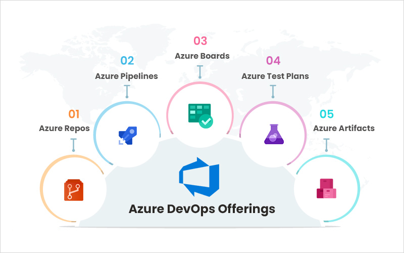
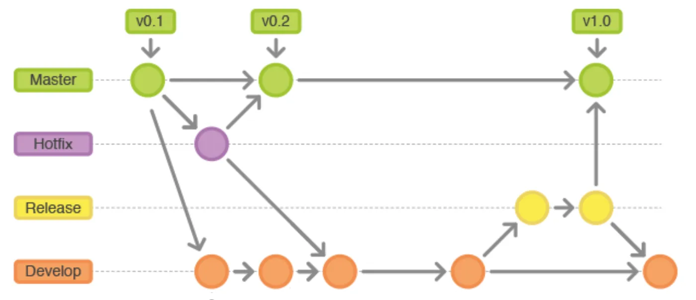
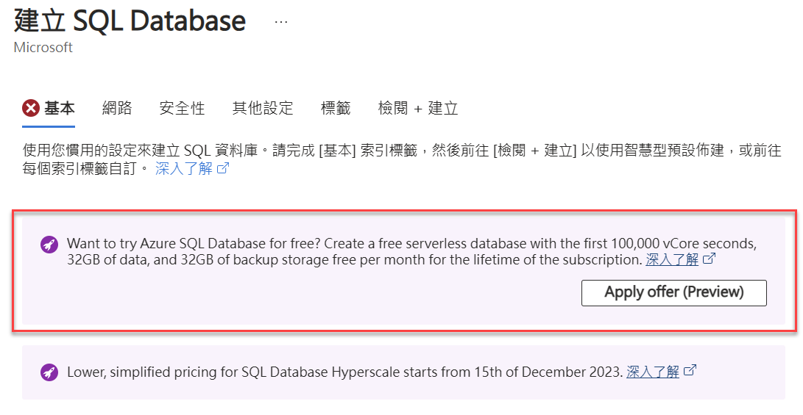
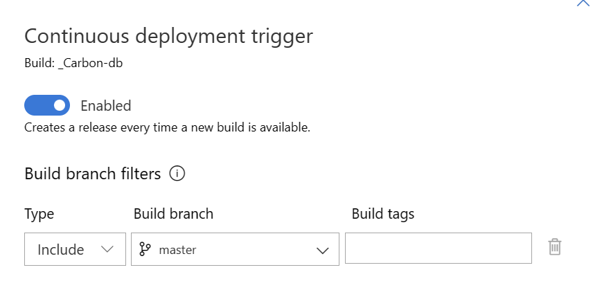
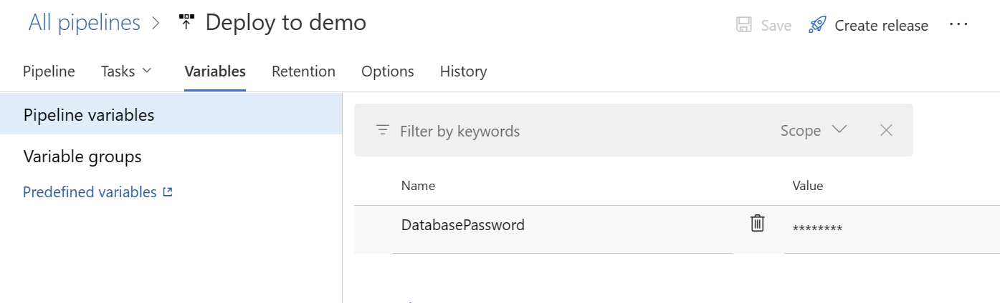

# SQL SUMMIT 2024

## Azure DevOps


## Git


## Azure SQL Database


## SQL Pipeline
```yaml
trigger:
- master
- develop

pool:
  vmImage: 'windows-latest'  # 不能用 ubuntu

variables:
  solution: '**/*.sln'
  buildPlatform: 'Any CPU'
  buildConfiguration: 'Release'

steps:
- task: VSBuild@1
  displayName: 'Build solution **\*.sln'
  inputs:
    solution: '$(solution)'
    platform: '$(buildPlatform)'
    configuration: '$(buildConfiguration)'
- task: CopyFiles@2
  displayName: 'Copy Files to: $(build.artifactstagingdirectory)'
  inputs:
    SourceFolder: '$(system.defaultworkingdirectory)'
    Contents: '**\bin\$(buildConfiguration)\**'
    TargetFolder: '$(build.artifactstagingdirectory)'
  condition: succeededOrFailed()
- task: PublishBuildArtifacts@1
  displayName: 'Publish Artifact'
  inputs:
    PathtoPublish: '$(build.artifactstagingdirectory)'
  condition: succeededOrFailed()

```

## Release Continue Deploy


## SQL Package

### 一般設定
```
/TargetTimeout:3600 /p:CommandTimeout=3600 /p:GenerateSmartDefaults=true /p:BlockOnPossibleDataLoss=false /p:IgnoreAnsiNulls=True /p:IgnoreComments=True
```

### 特殊設定透過變數指定參數
```
/v:db_ConnString=helloworld.database.windows.net
/v:db_PassWord=P@ssw0rd
```

```SQL
CREATE MASTER KEY ENCRYPTION BY PASSWORD = '$(db_PassWord)'
GO
CREATE EXTERNAL DATA SOURCE [CoreAuthSource]
    WITH (
    TYPE = RDBMS,
    LOCATION = N'$(db_ConnString)',
    DATABASE_NAME = N'DEMO',
    CREDENTIAL = [Auth_Credential]
    );
GO
```


## 設定變數保護


## 同步 Sequence
```sql
CREATE PROCEDURE [dbo].[SetSequenceValue]
	@EditNum INT OUTPUT,
	@Msg NVARCHAR(MAX) OUTPUT
AS
	DECLARE @ResultTable TABLE( TableName sysname, ColumnName sysname, SequenceName sysname, SequenceValue int , CurrentValue int )  

	DECLARE @TableName sysname ;
	DECLARE @ColumnName sysname ;
	DECLARE @SequenceName sysname ;
	DECLARE @CurrentValue int ;
	DECLARE @SequenceValue int ;

	DECLARE table_cursor CURSOR FOR  
		with x as
		(
			select OBJECT_NAME(parent_object_id) TableName, b.name ColumnName ,Substring( definition, 18, LEN(definition) - 19 ) SequenceName
			from sys.default_constraints a
			join sys.columns b ON a.parent_object_id = b.object_id and a.object_id = b.default_object_id
			where definition like '(NEXT VALUE%' 
		)
		select x.*, CAST( y.current_value as int ) 
		from x 
		join sys.sequences y ON x.SequenceName = y.name COLLATE DATABASE_DEFAULT 
		ORDER BY x.TableName
		--OFFSET 0 ROWS FETCH NEXT 2 ROWS ONLY

	OPEN table_cursor  
	FETCH NEXT FROM table_cursor   
		INTO @TableName, @ColumnName, @SequenceName, @SequenceValue  

	SET @EditNum = 0;
	SET @Msg = '';
	WHILE @@FETCH_STATUS = 0  
	BEGIN  
		DECLARE @ParmDefinition NVARCHAR(500);  
		DECLARE @SQL NVARCHAR(MAX) = 'select @MaxIntOut = isnull(max(['+@ColumnName+']),0) from [' + @TableName + ']' ;
		SET @ParmDefinition = N'@MaxIntOut INT OUTPUT';  
		DECLARE @max_int INT;  
		EXECUTE sp_executesql @SQL, @ParmDefinition, @MaxIntOut=@max_int OUTPUT;  
		SET @CurrentValue = @max_int;

		IF @SequenceValue<@CurrentValue
		BEGIN
			DECLARE @ParmDefinition_2 NVARCHAR(128)
			DECLARE @SQL_2 NVARCHAR(MAX) = 'SELECT @Value = NEXT VALUE FOR '+@SequenceName ;

			SET @ParmDefinition_2 = N'@Value INT OUTPUT';  
			DECLARE @SequenceValue_2 INT = @SequenceValue ;  
			WHILE ( @SequenceValue_2 < @CurrentValue )
			BEGIN
				EXECUTE sp_executesql @SQL_2, @ParmDefinition_2, @Value=@SequenceValue_2 OUTPUT;  
			END

			SET @EditNum = @EditNum + 1;
			SET @Msg = @Msg + @SequenceName + ' ' + TRIM(STR(@SequenceValue)) +'/'+ TRIM(STR(@CurrentValue)) +' IS EDITED; ';
		END

	    FETCH NEXT FROM table_cursor   
			INTO @TableName, @ColumnName, @SequenceName, @SequenceValue  
	END   

	CLOSE table_cursor;  
	DEALLOCATE table_cursor
```

