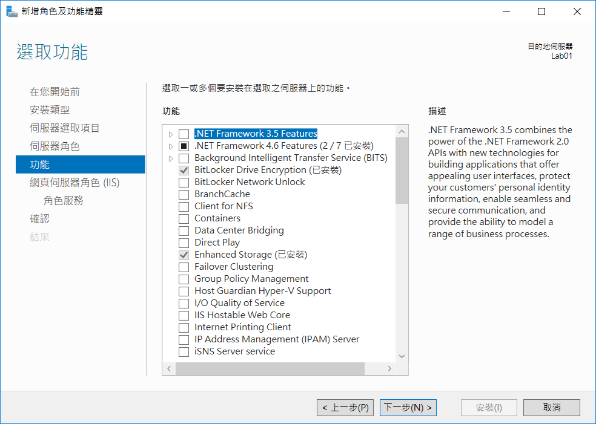

# Web API 後端安裝手冊

## IIS 安裝

### 透過新增角色與功能精靈

基本上直接選擇 *下一步* 就可以了

### 選擇安裝類型

這裡要記得選擇 *角色型或功能型安裝* , 選好後選擇 *下一步* 就可以了

### 伺服器選取項目

這裡要記得選擇 *從伺服器集區選取伺服器* , 選好後選擇 *下一步* 就可以了

### 伺服器角色

這裡要記得選擇 *Web Server (IIS)* , 選好後選擇 *下一步* 就可以了

### 功能

基本上直接選擇 *下一步* 就可以了

### 網頁伺服器角色

基本上直接選擇 *下一步* 就可以了

### 角色服務

基本上直接選擇 *下一步* 就可以了

### 確認

這裡要記得勾選 *並要時自動重新啟動目的伺服器* , 選好後選擇 *下一步* 就可以了

### 進行安裝

應該一下子就好了

---

## 安裝 .Net core

### 透過新增角色與功能精靈

安裝 .Net core 的 Runtime 可以連到 [官方網站](https://dotnet.microsoft.com/download/archives) 來進行下載，選擇 .Net core download

### 版本選擇

因為目前已經有新版本的 .Net core , 所以這裡我們選擇舊的版本，選取 .Net core 2.2 的版本

### RUNTIME 

目前 .Net core 2.2 已經到 2.2.8 的版本 , 如果下載的時候有更新的版本 , 那直接用 2.2 更新的即可。這裡我們選擇 「ASP.Net core Runtime 2.2.8 Windows」 的 Installers 版本 , 裡面的 *Hosting Bundle* 版本，這裡不要選錯版本。

### 安裝 .Net core runtime

將前一個步驟下載的檔案，執行起來即可看到安裝的畫面，這裡選擇接受 lincense 授權後按下 *Install* 即可進入安裝過程

### 完成 .Net core runtime

---

## IIS 設定

### 開啟 IIS 管理員進行設定

### 選擇站台確認 .Net core 模組

左邊先選擇站台，此時右邊會有相關站台功能，點選 *模組* 功能查看站台有支援的模組套件

### 模組清單

如果前面 .Net core Runtime 已經安裝完成，則這裡應該會看到有 AspNetCoreModuleV2 ，確認無誤即可關閉，否則就要回到前一個大項，確認您所下載並安裝的 .Net core ，有沒有正確下載到 Hosting Bundle 的版本來進行 .Net core 的安裝。

### 關閉預設站台

此時可以選擇左邊的站台節點，下面應該會有個 Default Web Site，這個站台我們不需要使用，會建立一個自己的，所以這裡要記得選擇右邊 管理網站→停止，將預設站台給關閉

### 新增站台

將預設網站關閉之後，即可回到右邊 *站台* 的節點上，我們就可以來建立我們所需要使用的新站台，此時選擇右邊 動作→新增網站

### 站台設定

我們將站台名稱設定為 API (這只是個名稱，你可以設定你喜歡的)，然後實體路徑指向一個我們等一下用來放我們程式的目錄，這裡我們設定為 C:\API 的目錄下面

### 警告訊息

正常來說會出現警告，但我們前面已經將預設站台給關閉了，所以這裡就不用管他了。

### 應用程式集區

因為 IIS 預設是搭配 .Net framework , 所以這裡我們要來針對我們的站台做個調整，因此左邊樹狀節點我們選擇 *應用程式集區* ，然後點選前一個步驟站台名稱的集區。

### .Net CLR 版本

這裡將中間的 .Net CLR 版本做個調整，改成 *沒有 Managed 程式碼* ，改好之後就選擇 確定 按鈕來結束。

---

## 測試

### 開啟 Swagger 進行測試

用瀏覽器開啟 127.0.0.1/swagger 的網站，如果能正常開啟則表示應用程式已經安裝完成，此時可以透過其他電腦來連接，確認 Windows 的防火牆是否有被開啟。

